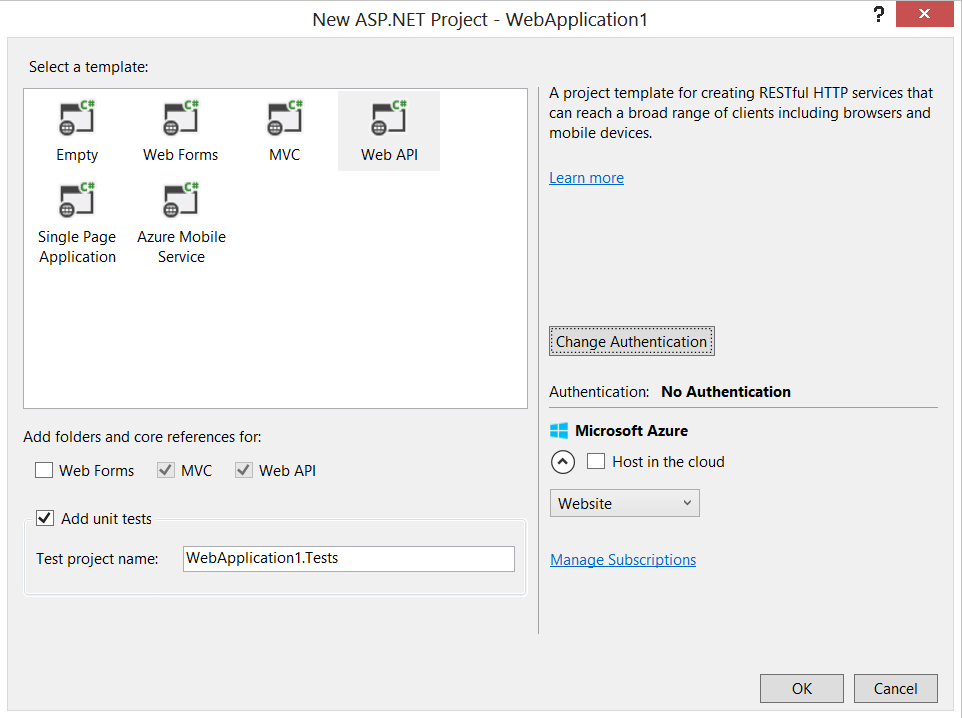

# Dreitägiger ASP.NET MVC Workshop
Ihr Trainer: [Johannes Hoppe](http://www.haushoppe-its.de)

## Tag 1 - Agenda

1. Grundlagen, Besprechung der Fragen zur Vorbereitung
2. [Anlegen eines ASP.NET Web API Projekts (Routing, Bundling)](#projekt)
3. [Anlegen von DTOs / POCOs (Geschäftsobjekte)](#poco)
4. [Einrichten von Entity Framework, Code First](ef)
5. Repository (CRUD) – Tests!
6. [Implementierung MVC Controllers / Web API Controllers – Tests!](#controller)
7. Hello World View
8. Besprechung [AntiRequestForgeryToken]
9. Vergleich "Daily-Work"-Software mit Trainingsinhalt


<a name="projekt"></a>
## 2. Anlegen eines ASP.NET Web API Projekts

Wir verwenden folgendes Projekt-Template aus Visual Studio:
File > New > Project > Templates > Visual C# > Web > **"ASP.NET Web Application"**


Dabei wählen wir ein Web API Projekt aus:



Wir besprechen folgende Ordner:

1. Models
2. Views
3. Controllers

sowie

1. Content
2. Scripts


<a name="poco"></a>
## 3. Anlegen von DTOs / POCOs (Geschäftsobjekte)

Wir werden einfache "Data Transfer Objekte" (DTO) bzw. "Plain Old CLR Objects" (POCO) verwenden. Hiermit können wir die Daten unserer "Geschäftslogik" halten. Es gibt verschiedene Architektur-Stile, bei vielen sollten "Geschäftsobjekte" nicht nur Daten sondern auch Methoden besitzen. Für eine einfache Anwendung ist es absolut ausreichend, nicht zwischen "Entitäten" (ein Begriff des[ Domain Driven Designs](http://dddcommunity.org/) von Eric Evans) und zwischen DTOs / POCOs zu unterscheiden. Wir verwenden die POCOs direkt und hauchen Ihnen später etwas Leben ein - mithilfe des Entity Frameworks. Es ist aber wichtig zu erkennen, das wir dadurch ein "**Anemic** domain model" erstellen. Dieses gilt als Anti-Pattern im Sinne des Domain Driven Designs. Die Verwendung des Entity Frameworks garantiert übrigens nicht, das wir nun Entitäten im Sinne von Domain Driven Design besitzen. Der Begriff ist hier doppeldeutig.

Ein sehr einfaches POCO kann z.B. so ausschauen:

```csharp
public class Customer
{
    public int Id { get; set; }
    public string FirstName { get; set; }
    public string LastName { get; set; }
    public string Mail { get; set; }
}
```

<a name="ef"></a>
## 4. Einrichten von Entity Framework, Code First

Als Data Access Layer (DAL) verwenden wir das Entitiy Framework, dessen in frühere Versionen Teil des .NET Framework sind. Die neueste Versionen sind nun direkt per [Nuget](https://www.nuget.org/packages/entityframework) verfügbar. 

Um mit dem Code-First Ansatz zu starten, ist es notwendig eine Klasse zu erstellen, welche von System.Data.Entity.DbContext erbt. Hier geben wir alle vom EF zu berücksichtigen POCOs an. Der Rest geschieht weitgehend über den "Convention over Configuration" Ansatz.

```csharp
public class MyContext : DbContext 
{ 
    public DbSet<Customer> Customers { get; set; } 
}

```

Leider ist diese einfache Variante schwer zu testen, daher sollten wir folgenden mockbaren Context bevorzugen:


```csharp
public class MyContext : DbContext, IMyContext
{ 
    public IDbSet<Customer> Customers { get; set; } 
}

public interface IMyContext
{
    IDbSet<Customer> Customers { get; set; }

    int SaveChanges();
}

```

Das originale DbSet implementiert bereits das Interface IDbSet.
Als Ersatz bei Unit-Tests empfehle ich zum Beispiel folgendes In-Memory-Dbset:
https://www.nuget.org/packages/FakeDbSet/

Zusammen mit dem Mocking-Framework [Moq](https://github.com/Moq/moq4) können wir so sehr leicht IDbSet (durch FakeDbSet) und IMyContext (durch Moq) wie folgt ersetzen:

```csharp
InMemoryDbSet<Customer> inMemoryDbSet = new InMemoryDbSet<Customer>(true);

var mockedContext = new Mock<IMyContext>();
mockedContext.Setup(m => m.Customers).Returns(inMemoryDbSet);
repository = new CustomerRepository(mockedContext.Object);

```

Ein weiteres Beispiel findet sich [hier](https://github.com/a-h/FakeDbSet/blob/master/Examples/Example.BusinessLogicTest/FakeDatabase.cs), dort wird ein Ersatz des Kontext gezeigt, welcher leicht ohne zweites Mocking-Framework auskommt.


<a name="controller"></a>
## 6. Implementierung MVC Controllers / Web API Controllers

Wir werden einen MVC Controller sowie einen Web API Controller anlegen, dies wird durch das Tooling von Visual Studio sehr gut unterstützt. 

Eine auf Azure gehostete Version des Kunden-Controllers (Web API) sehen sie hier:
http://ex.extjs-kochbuch.de/api/customer

Der Controller wird durch folgende [Help Page](http://www.asp.net/web-api/overview/creating-web-apis/creating-api-help-pages) beschrieben:
http://ex.extjs-kochbuch.de/help

Den Quelltext finden Sie hier:
[CustomerController.cs](https://github.com/JohannesHoppe/ExtJsKochbuch/blob/master/examples/Kochbuch/Controllers/CustomerController.cs)